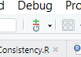
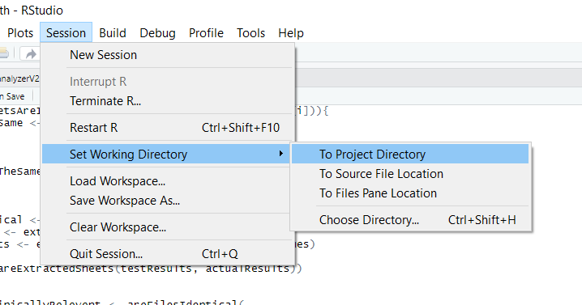
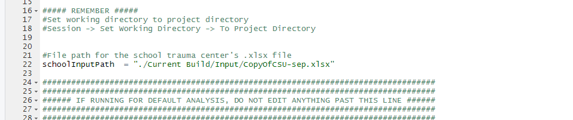

# Introduction
This project is designed to help schools assess the quality of their VetCot database. The programs in this Github allow a school to evaluate things such as improbable entries (i.e. a 240 lb dog), mismatches between EMR records and VetCot records, etc. This document contains the steps to help set up the environment required to run these programs.

### Setup
#### Required Programs
* [R](https://cran.r-project.org/)
* [Rstudio](https://www.rstudio.com/products/rstudio/download/) (Desktop version should work fine)
* [git](https://git-scm.com/downloads) (You don't need the GUI to run this tool)

For a detailed description of each program, see the corresponding README file in the README folder.

### Tutorials
If you have not previously used Rstudio, it is highly recommended that you watch [this](https://www.youtube.com/watch?v=FIrsOBy5k58) tutorial. It is not necessary that you understand how R works provided you can run the programs in this repository. In addition, it is recommend that you use the files tab in the lower right hand panel on Rstudio to open the programs in this repository as well as to open the output files generated by these programs. The files tab works like file explorer. Finally, to use git with Rstudio, use the icon depicted below to access git functionality. This icon is found near the top of Rstudio near the right edge of the icons.

#### Configure
Configure Rstudio to be compatible with git and pull this repo as a project into Rstudio. For instructions, see [here](https://cfss.uchicago.edu/setup/git-with-rstudio/) (You only need to know how to do the first two steps. This website is a good starting spot if you want any further information on how to use Git/GitHub/R/Rstudio). If you're having trouble with the project, see [here](https://support.rstudio.com/hc/en-us/articles/200526207-Using-Projects). 

Finally, run install.R (found under the home directory of the repository) to install or update all the packages required for running the analyzer. Under the run section, see step 3 for how to open the script (you'll need to go to the project home directory, not ./Current Build/Code) and see step 5 for how to run all the lines in install.r.

***\*Two of these programs are desinged to run with only RedCAP entries. One program is designed to use data with RedCAP and EMR entries. The EMR entries must follow specific guidlines detailed below and will likely have to be encoded by hand.\**** 

### Run

If the user wants to run analyzerAccuracy.R, before a user attempts to look at and use the program, they must ensure that their spreadsheets of data adhere STRICTLY to the data requirements outlined in the data requirements section found below. For all other programs, simply follow the instructions below.
1. Extract data from VetCot and put it into an Excel spreadsheet
2. Set your working directory in R to the project location 

3. Open the analyzer that you want to run
   1.  Go to the lower right pane in Rstudio and click the files tab. Go to ./Current Build/Code and double-click on the analyzer you want to run.
4. Set schoolInputPath to the file path of the data source’s excel spreadsheet. It is recommended that you put your input file in the input directory and simply change the name of the Excel sheet (the part after ./Current Build/Input) to match the name of your Excel sheet. (If running analyzerAccuracy.R, the trauma center data should be in the 'separated' form, meaning that the redcap data is in one sheet and the emr data is in another)

5. Run all lines of the program 
   1. Select all the lines by clicking in the script and using the command ctrl+a, then run the script with the command ctrl+enter 
6. An analysis spreadsheet will be created in the output folder after “Analysis Complete!” is printed in R’s terminal 
   - Note: This may take a while depending on how powerful your computer is; this is a lot of data for one computer to handle. 
   - Note: you may need to delete, move, or rename previously created spreadsheets before running the program again to receive updated spreadsheets if data/code has changed.

### Data Requirements
1. The VetCot data doesn't have to be modified and if not running analyzerAccuracy.R, this section can be ignored
1. The input school’s spreadsheet must be separated into sheets in this order, excluding Optional entry sheets if they are not present in your desired data: 
   1. RedCAP entries (with both optional and mandatory variables) 
   1. EMR Mandatory entries (with both optional and mandatory variables) 
1. Optional Variables are defined as the following: 
1. AFASTYN 
1. TFASTYN 
1. bloodLactate 
1. baseExcess 
1. ionCalcium 
1. pcv 
1. TS 
1. bloodGlucose 
3. The following fields may be a combination of string and numeric-typed values, as they have been already specified as non-numeric in code: 
1. ID 
1. presentationDate 
1. entryDate 
4. Records must have matching entries in the ‘caseNum’ field to be correctly joined between sheets - this is the primary key that all comparative analysis hinges on 
4. All continuous, numerical columns MUST be devoid of string-type data in order for the column to be recognized as and included in continuous-variable analysis. *(ex. “?1.0” is not allowed, please use “1.0”)* 

a. These fields include: 

1. weightCat 
2. weightDog 
2. catAge 
2. dogAge 
2. ionCalcium 
2. pcv 
2. TS 
8. bloodGlucose 
9. bloodLactate 
9. baseExcess 
6. There should be NO blank rows in the data; this is fatal to the program.
- **Important Note:** The first page of the Excel sheet must be VetCot data and the second page must be EMR data (if EMR data is being used). The programs rely on this fact.
- *Note:* If a spreadsheet is in the above form, it can be used for all three programs. EMR data will be ignored when it isn't needed.

### Testing
If these programs are run with the example input file found in the directory ./Current Build/Input, the output should match the corresponding test output files found in the directory ./Current Build/Output.
