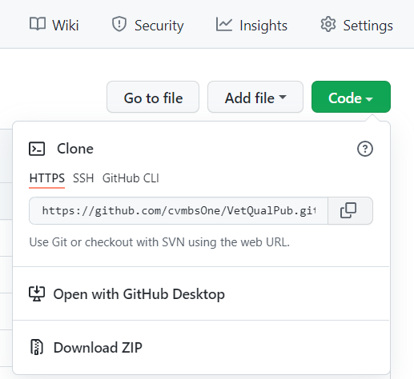

# Introduction
This project is designed to help schools assess the quality of their VetCot database. The programs in this Github allow a school to evaluate things such as improbable entries (i.e. a 240 lb dog), mismatches between EMR records and VetCot records, etc. This document contains the steps to help set up the environment required to run these programs.

### Setup
#### Required Programs
* [R](https://cran.r-project.org/)
* [Rstudio](https://www.rstudio.com/products/rstudio/download/) (Desktop version should work fine)
* [git](https://git-scm.com/downloads) (*optional if you want to use git to pull code, fork a copy, or if you already have write permissions in this project)

For a detailed description of each program, see the corresponding README file in the README folder.

### Tutorials
If you have not previously used Rstudio, it is highly recommended that you watch [this](https://www.youtube.com/watch?v=FIrsOBy5k58) tutorial. It is not necessary that you understand how R works provided you can run the programs in this repository. In addition, it is recommend that you use the files tab in the lower right hand panel on Rstudio to open the programs in this repository as well as to open the output files generated by these programs. The files tab works like file explorer. 

### Configure
If you only want to run the code with the provided test data or your own data, and don’t need to interact with git version control, download the code manually by clicking the green "Code" link at the home directory of this repository. Select the option, "download ZIP" and extract the ZIP file. 

Before you run the code, you will have to use the files tab in Rstudio to find the downloaded project's home directory. Then click on the file VetCot-R.Rproj.

*Optional: if you want to configure RStudio to be compatible with git version control and pull, fork code etc, you can review [this](https://cfss.uchicago.edu/setup/git-with-rstudio/) link for general info on how to integrate Rstudio projects with GitHub repositories (You only need to know how to do the first two steps. This website is a good starting spot if you want any further information on how to use Git/GitHub/R/Rstudio). If you're having trouble with the project, see [here](https://support.rstudio.com/hc/en-us/articles/200526207-Using-Projects).

***\*Two of these programs are designed to run with only RedCAP entries. One program is designed to use data with RedCAP and EMR entries. The EMR entries must follow specific guidlines detailed below and may have to be entered by hand.\**** 

### Run

If the user wants to run analyzerAccuracy.R, before a user attempts to look at and use the program, they must ensure that their spreadsheets of data adhere STRICTLY to the data requirements outlined in the data requirements section found below. For all other programs, simply follow the instructions below.
1. Extract data from VetCot and put it into an Excel spreadsheet
2. Set your working directory in R to the project location 

3. Open the analyzer that you want to run
   1.  Go to the files tab in the lower right pane in Rstudio. Go to ./Current Build/Code and double-click on the analyzer you want to run.
4. Set schoolInputPath to the file path of the data source’s excel spreadsheet. To do this, put your input file in the input directory (./Current Build/Input) and change the name of the Excel sheet (the part after ./Current Build/Input) to match the name of your Excel sheet. If running analyzerAccuracy.R, the trauma center data should be in the 'separated' form, meaning that the redcap data is in one sheet and the emr data is in another. 
   
   **IMPORTANT:** Be 100% certain that the name of the excel file matches the name of the input file you uploaded to the input directory. DO NOT change the path portion of schoolInputPath. Failure to follow these instructions will likely result in the error message, "could not find function read_excel"

5. Run all lines of the program 
   1. Select all the lines by clicking in the script and using the command ctrl+a, then run the script with the command ctrl+enter 
6. An analysis spreadsheet will be created in the folder ./Current Build/Output after “Analysis Complete!” is printed in R’s terminal. To view this file, go to the files tab in the lower right hand panel of Rstudio and go to the folder ./Current Build/Output and click on the file, then click view file. 
   - Note: This may take a while depending on how powerful your computer is; this is a lot of data for one computer to handle. 
   - Note: you may need to delete, move, or rename previously created spreadsheets before running the program again to receive updated spreadsheets if data/code has changed.

### Data Requirements
The VetCot data doesn't have to be modified and if not running analyzerAccuracy.R, this section can be ignored
1. The input school’s spreadsheet must be separated into sheets in this order: 
   1. RedCAP entries (with both optional and mandatory variables) 
   2. EMR entries (with both optional and mandatory variables) 
2. The distinction between madatory and optional variables is not significant. Mandatory variables are those we recommend encoding if they are available. Optional variables are those that significant value will likely not be gleaned from. The only variable that is truely required is caseNum. Optional Variables are defined as the following: 
   - AFASTYN 
   - TFASTYN 
   - bloodLactate 
   - baseExcess 
   - ionCalcium 
   - pcv 
   - TS 
   - bloodGlucose 
3. The following fields may be a combination of string and numeric-typed values, as they have been already specified as non-numeric in code: 
   - caseNum
   - ID 
   - presentationDate 
   - entryDate
4. Records must have matching entries in the ‘caseNum’ field to be correctly joined between sheets - this is the primary key that all comparative analysis hinges on 
5. All continuous, numerical columns MUST be devoid of string-type data in order for the column to be recognized as and included in continuous-variable analysis. *(ex. “?1.0” is not allowed, please use “1.0”)* These fields include: 

   - weightCat 
   - weightDog 
   - catAge 
   - dogAge 
   - ionCalcium 
   - pcv 
   - TS 
   - bloodGlucose 
   - bloodLactate 
   - baseExcess 
6. There should be NO blank rows in the data; this is fatal to the program.
- **Important Note:** The first page of the Excel sheet must be VetCot data and the second page must be EMR data (if EMR data is being used). The programs rely on this fact.
- *Note:* If a spreadsheet is in the above form, it can be used for all three programs. EMR data will be ignored when it isn't needed.
### Testing
If these programs are run with the example input file found in the directory ./Current Build/Input, the output should match the corresponding test output files found in the directory ./Current Build/Output.

### Mapping of RedCap fields to EMR fields
In case there are any questions about the meaning of EMR fields, we have provided the corresponding RedCap fields. For more information about the EMR field, simply look up information on the RedCap field. The list is in the form <EMR field> <corresponding RedCap field>.
   - ID tr_subject_id
   - presentationDate tr_date_of_hosp
   - species tr_species
   - catBreed tr_cat_breed
   - dogBreed tr_dog_breed
   - dogAge tr_age_canine
   - catAge tr_feline_age
   - sex tr_sex
   - weightDog tr_weight
   - weightCat tr_weight2_436
   - priorDVM tr_prior_treat
   - opK9 opk9_status
   - priorNonDVM pre_hosp_non_dvm_yn
   - traumaType tr_trauma_type
   - bluntScale tr_trauma_blunt
   - penetratingScale tr_trauma_penet
   - traumaDateYN tr_trauma_dt_known
   - traumaTimeYN tr_time_trauma_known
   - presentation_time_known presentation_time_known
   - ICU tr_icu
   - motorScale tr_mgcs_motor
   - brainScale tr_mgcs_brain
   - consciousScale tr_mgcs_cons
   - MGCSscore tr_mgcs_score
   - headinjYN tr_head_inj_yn
   - spinalinjYN tr_spinal_trauma_yn
   - perfusionScale tr_att_perf
   - cardiacScale tr_att_card
   - respScale tr_att_resp
   - eyeMuscleSkinScale tr_att_emi
   - skeletalScale tr_att_skel
   - neuroScale tr_att_neuro
   - ATTscore tr_att_score
   - surgeryYN o_surgery
   - bloodProductsYN o_blood_yn
   - outcome o_outcome
   - outcomeDate o_outcome_dt
   - AFASTYN trs_afast
   - TFASTYN trs_tfast
   - bloodLactate trs_blood_lac
   - baseExcess trs_base_ex
   - ionCalcium trs_ion_ca
   - pcv trs_pcv
   - TS trs_solids
   - bloodGlucose trs_glucose

